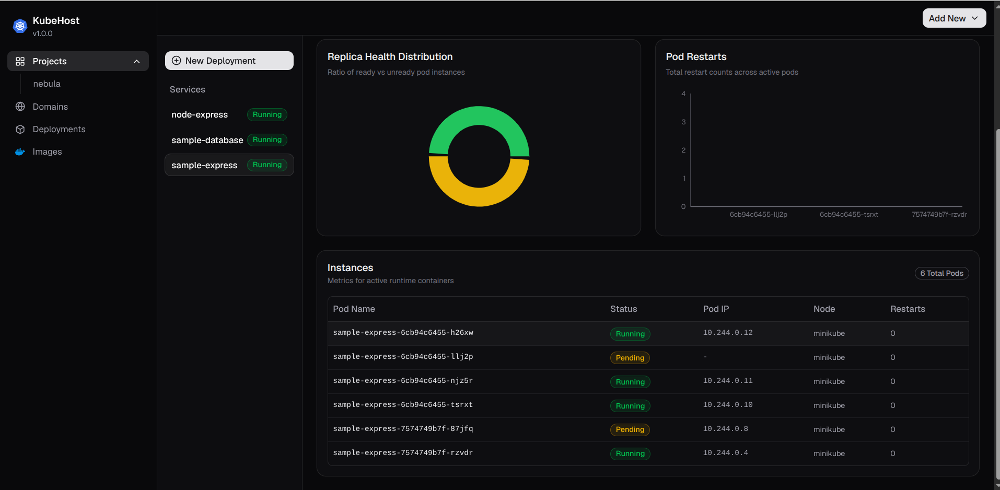

# KubeHost

**A deployment platform for your apps - like a cloud provider, but self-hosted.**

Just provide your Docker image - kubehost handles networking, load balancing and HA complexities behind the scenes.



We've all been there: it's a hackathon, your app is ready, and now you're
burning your last hours setting up a server just to make it live. KubeHost
solves that.

Give it a Docker image and a domain, and your app is live. That's it.
(Built on top of Kubernetes)

> [!WARNING]
> **Not for production.** KubeHost is meant for demos, hackathons, and
> competition projects - a quick, temporary way to get something live.
> It's not built or hardened for hosting real, production applications.

## How it works

1. Create a project
2. Create a deployment
3. Give it your Docker image
4. Add a domain. By default, `/` (the root) points to your deployment.
   You can optionally add extra paths under the same domain to route
   traffic to other deployments - for example, if `example.com` serves
   your client app, you can add `example.com/api` to route API requests
   to your backend/API deployment.
6. Point your domain's DNS to your VPS's public IP

Your app is now live.
specific deployment.

## Connecting services to each other (e.g. a database)

Don't use `localhost` to connect one deployment to another - use the
**deployment's name** as the host instead.

Example: if your database deployment is named `my-database`, set
`DB_HOST=my-database` in your app - not `localhost`, not an IP.

## Requirements

Install these on your VPS (or local machine) before using KubeHost:

- **Docker** - https://docs.docker.com/engine/install/
- **Minikube** - https://minikube.sigs.k8s.io/docs/start/?arch=%2Flinux%2Fx86-64%2Fstable%2Fbinary+download

## Install (on a VPS)

```bash
curl -sSL https://raw.githubusercontent.com/gitmahin/kubehost/main/install.sh | sudo bash
```

See all commands:
```bash
kubehost --help
```
> [!WARNING]
> Before starting, grant your user permission to run Docker commands without sudo.
```bash
sudo usermod -aG docker $USER
newgrp docker
```

Start it:
```bash
kubehost --api-server http://<your_domain>:3000/api
```
> Port `3000/api` is required - that's where the API server listens.

Don't worry about port conflicts between your deployments - even if two
services use the same port, KubeHost routes them correctly on its own.

*Once KubeHost starts successfully, open the dashboard in your browser:*

http://<your_domain>:3001

> [!WARNING]
> **Do not change ports 3000 or 3001.** These are fixed and required:
> - **Port 3000** - API server (used internally)
> - **Port 3001** - Client dashboard (this is what you open in your browser)
>
> If these ports are blocked, changed, or not opened in your firewall/security group, you will not be able to access the dashboard or use KubeHost at all.

### Setup Inbound rules (e.g. AWS EC2 security group)

| Type | Port | Source    |
|------|------|-----------|
| TCP  | 3000 | 0.0.0.0/0 |
| TCP  | 3001 | 0.0.0.0/0 |
| TCP  | 80   | 0.0.0.0/0 |

## Running locally

**Linux:**
```bash
kubehost --api-server http://localhost:3000/api
```
Locally you have to provide localhost here
But rest is same as Production deployment

**Windows:** the CLI requires Linux, so clone and run it manually instead:
```bash
git clone https://github.com/gitmahin/kubehost.git
cd kubehost
pnpm install
pnpm dev
```

---

Happy deploying! 🚀
